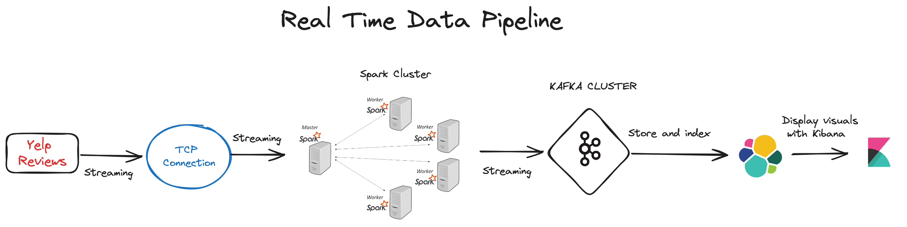
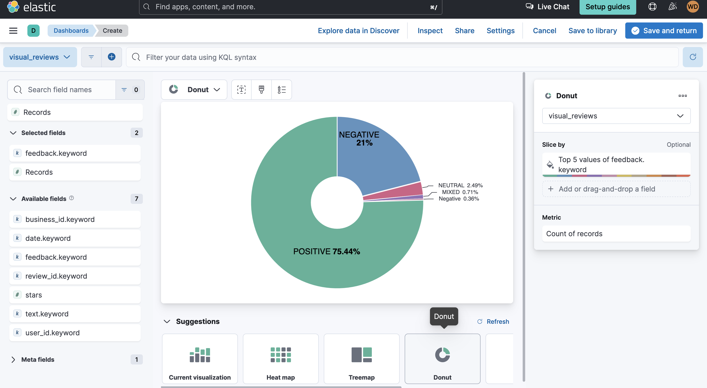
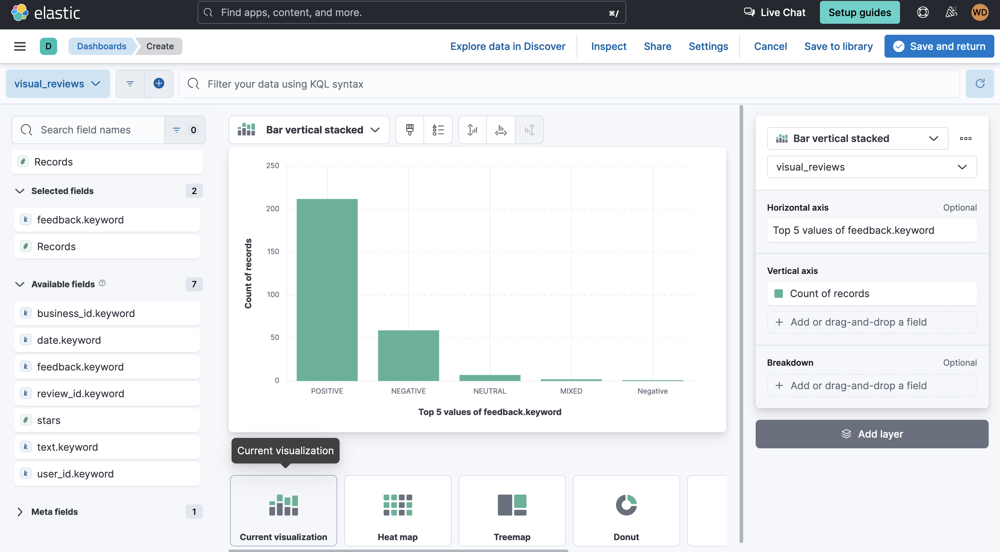
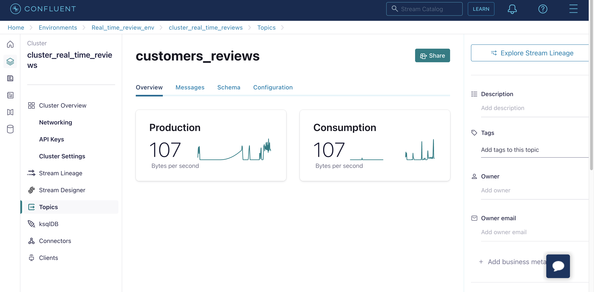

# Data-Engineering-project

## Schema of the Data Pipeline

## Summary
The goal of this project is to create a real time data engineering pipeline that takes in input reviews from Yelp.com (https://www.yelp.com/dataset) and apply Sentiment Analysis to it. The reviews will be classified into 3 categories : POSITIVE, NEGATIVE, NEUTRAL.
For the pipeline we will be using the following tools : 
- First we establishe a TCP socket connection, reads data from a the Yelp reviews file. Then, we chunks this data and sends them over the socket to a specified host and port, pausing for 5 seconds between each chunk.
- Secondly, we establish a Spark cluster to ingest streaming data from the socket, format it using Spark, conduct sentiment analysis on the text utilizing OpenAI's GPT-3.5 model, and subsequently transmit the sentiment analysis outcomes to a Kafka topic. We use Confluent Cloud interface to create the topic.
- Thirdly, we create a connector between Kafka and Elasticsearch. We use Elasticsearch as a data sink to store and index the reviews. We use Kibana to visualize sentiment trends in real-time and DevTools for querying the data. We create a dashboard to monitor sentiment scores, visualize positive/negative trends, and so on.

## Some visuals and stats of the result
### Pie chart representing the sentiment analysis of a sample

### Bar plot on the sentiment analysis

### Kakfa Cluster on Confluent Cloud

  

 
